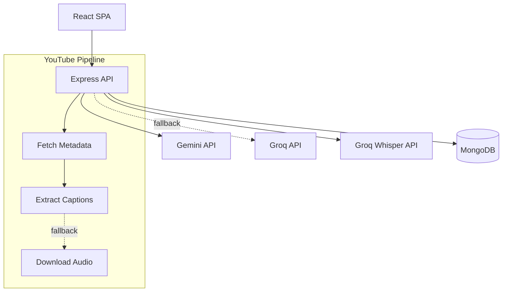

# Scriptly

> Turn lectures into exam-ready study material in minutes.

Scriptly is an AI-powered study acceleration platform that transforms raw audio, video, and YouTube lectures into highly structured study guides. It goes beyond simple transcription by generating key concepts, flashcards, quizzes, and guided active-recall revision flows to reduce study time and improve retention.

## Key Features

- **Multi-modal Input:** Record live audio, upload local files (audio/video), or process YouTube links directly.
- **Resilient AI Pipeline:** Built with an intelligent fallback system (Gemini 2.5 Flash as primary, Groq LLaMA as fallback) for high reliability.
- **Structured Study Guides:** Automatically extracts key concepts, memory anchors, glossaries, and potential exam questions.
- **Active Recall Workflows:** Features an interactive revision mode, flashcard progression tracking, and dynamically generated MCQ quizzes.
- **Concept Explanation:** Context-aware "Explain this" tooltip for any highlighted term in your notes.
- **Export & Portability:** Client-side PDF export with lazy-loaded dependencies for performance.

## Screenshots

<!-- Add screenshots here -->
<!--  -->
<!--  -->
<!--  -->

## Architecture



## Tech Stack

| Category | Technology | Why |
|----------|------------|-----|
| **Frontend** | React 19, Vite, React Router 7 | Fast builds, modern rendering, client-side routing |
| **Backend** | Express.js 5, Node.js | Robust API layer, modular architecture |
| **Database** | MongoDB, Mongoose | Flexible schema for unstructured AI outputs |
| **Auth** | Passport.js, MongoStore | Secure, persistent session-based authentication |
| **AI Models** | Gemini 2.5 Flash, Groq (Whisper/LLaMA) | High speed, cost-effective, redundant providers |
| **Testing** | Vitest, React Testing Library, mongodb-memory-server | Fast, isolated unit and integration testing |

## Project Structure

```text
scriptly/
├── client/                 # React frontend
│   ├── src/
│   │   ├── components/     # Reusable UI components
│   │   ├── pages/          # Route-level components
│   │   ├── services/       # API integration layer
│   │   └── styles/         # Vanilla CSS modules
├── server/                 # Express backend
│   ├── config/             # Constants and environment setup
│   ├── models/             # Mongoose schemas
│   ├── modules/            # Feature-based routes and controllers
│   │   ├── ai/             # AI generation and fallback logic
│   │   ├── auth/           # Passport authentication
│   │   ├── notes/          # CRUD operations for study materials
│   │   └── youtube/        # Video processing pipeline
│   ├── tests/              # Backend integration tests
│   └── utils/              # Shared utilities (logger, cleanup)
```

## Getting Started

### Prerequisites
- Node.js (v18+)
- MongoDB (local or Atlas)
- API Keys: Google Gemini, Groq

### Setup

1. **Clone the repository:**
   ```bash
   git clone https://github.com/yourusername/scriptly.git
   cd scriptly
   ```

2. **Install dependencies:**
   ```bash
   npm run install:all
   ```

3. **Configure Environment Variables:**
   - Copy `server/.env.example` to `server/.env` and fill in your keys.
   - Copy `client/.env.example` to `client/.env` (optional for local dev).

4. **Run the application:**
   ```bash
   # Terminal 1 (Backend)
   npm run dev:server
   
   # Terminal 2 (Frontend)
   npm run dev:client
   ```

## Environment Variables

| Variable | Location | Description |
|----------|----------|-------------|
| `MONGO_URI` | Server | MongoDB connection string |
| `SESSION_SECRET` | Server | Secret for signing session cookies |
| `GEMINI_API_KEY` | Server | Primary LLM provider |
| `GROQ_API_KEY` | Server | Whisper transcription & Fallback LLM |
| `VITE_API_URL` | Client | Backend URL (defaults to `/api` with Vite proxy) |

## Testing

The project uses a dual-testing strategy:

```bash
# Run all tests (frontend + backend)
npm run test

# Run only frontend tests (React Testing Library)
npm run test:client

# Run only backend tests (Vitest + in-memory MongoDB)
npm run test:server
```

## Engineering Highlights

- **Multi-provider AI Fallback:** The summarization pipeline automatically falls back to a secondary LLM provider if the primary encounters rate limits or errors, ensuring high availability.
- **Atomic Database Updates:** Uses `$set` and `findOneAndUpdate` operators to prevent Mongoose `VersionError` race conditions during concurrent frontend actions (e.g., auto-saving while generating a quiz).
- **Graceful YouTube Processing:** Attempts to extract pre-generated captions first. If unavailable, falls back to downloading the audio stream for Whisper transcription, handling both scenarios seamlessly.
- **Optimized Bundle Size:** Heavy dependencies like `html2pdf.js` for exporting notes are lazy-loaded only when a user triggers an export, keeping the initial client payload small.
- **Field Projection & Pagination:** API endpoints request only the necessary fields (e.g., excluding full transcripts on the notes list page) to minimize payload size and improve perceived performance.

## Deployment

- **Frontend:** Optimized for Vercel deployment.
- **Backend:** Designed for Render or Heroku. Configured with `trust proxy` for secure cross-origin session cookies in production.
